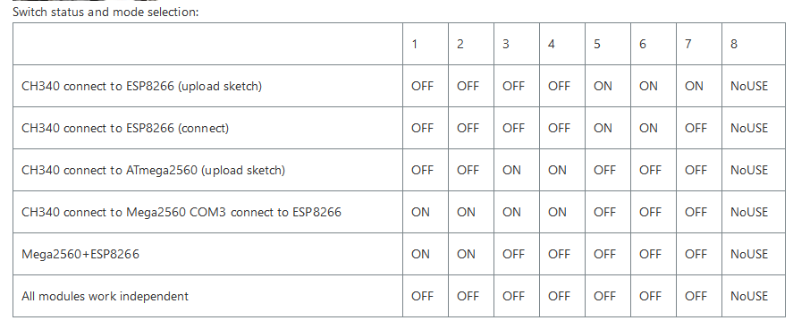

# DIP_SWITCH.md

## Nastavení DIP switchů

### Přehled režimů

| Režim | Switch 1-4 | Switch 5-7 | Použití |
|-------|------------|------------|---------|
| **CH340 → ESP8266 (nahrávání)** | OFF OFF OFF OFF | ON ON ON | Nahrání kódu do ESP8266 |
| **CH340 → ESP8266 (komunikace)** | OFF OFF OFF OFF | ON ON OFF | Běžná komunikace s ESP8266 |
| **CH340 → Mega2560 (nahrávání)** | OFF OFF ON ON | OFF OFF OFF | Nahrání kódu do Arduino Mega |
| **Mega2560 + ESP8266 (propojení)** | ON ON ON ON | OFF OFF OFF | Komunikace mezi Mega a ESP8266 |
| **Mega2560 + ESP8266 (běžný provoz)** | ON ON OFF OFF | OFF OFF OFF | Normální provoz projektu |
| **Samostatné moduly** | OFF OFF OFF OFF | OFF OFF OFF | Všechny moduly nezávisle |

### Důležité upozornění

⚠️ **Před nahráváním kódu vždy zkontroluj správné nastavení DIP switchů!**

- Switch 8 se nepoužívá (NoUSE)
- Po nahrání kódu nezapomeň přepnout do běžného provozního režimu

### Standardní workflow

1. **Nahrání do ESP8266**: Nastav switche pro "CH340 → ESP8266 (nahrávání)"
2. **Nahrání do Mega**: Nastav switche pro "CH340 → Mega2560 (nahrávání)"
3. **Běžný provoz**: Přepni na "Mega2560 + ESP8266 (běžný provoz)"